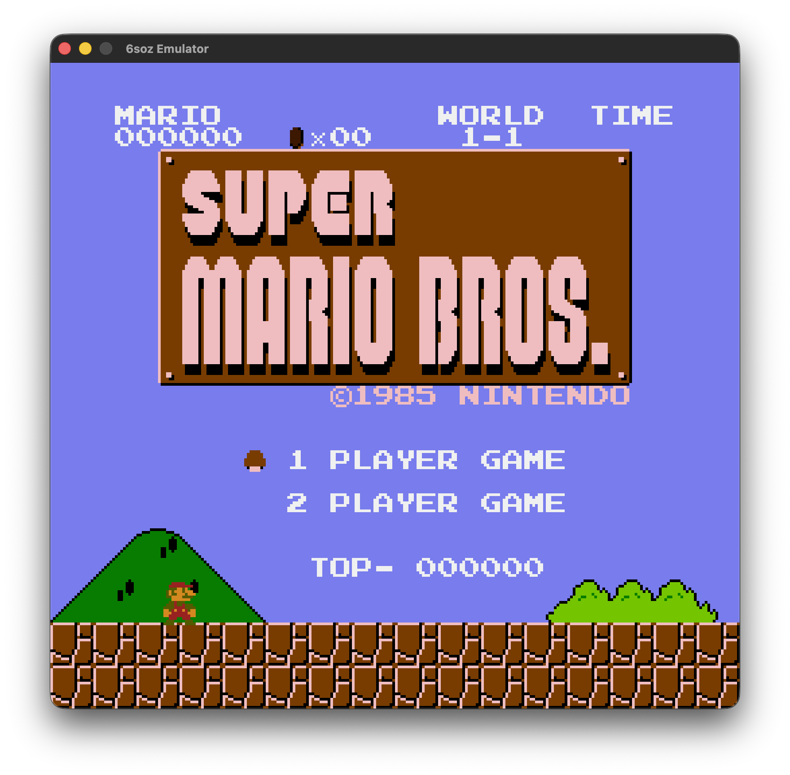
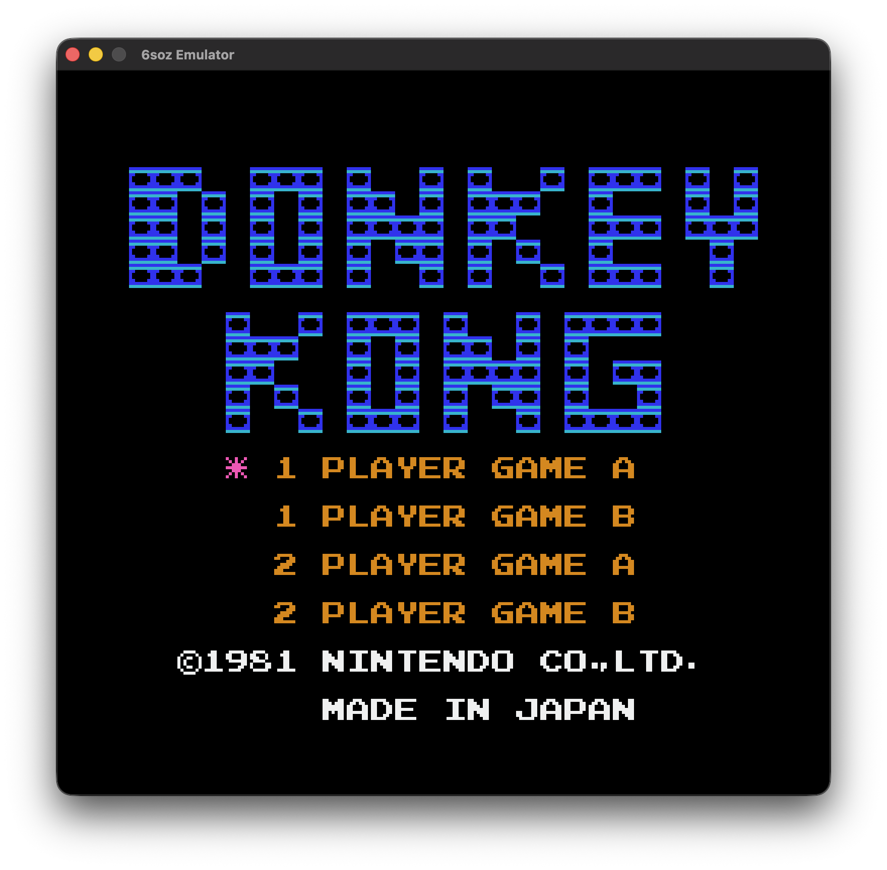
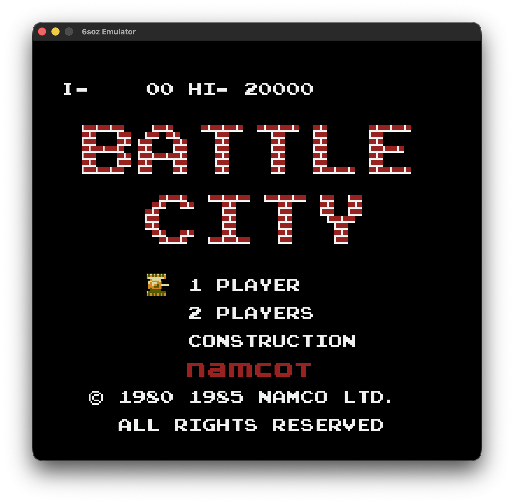
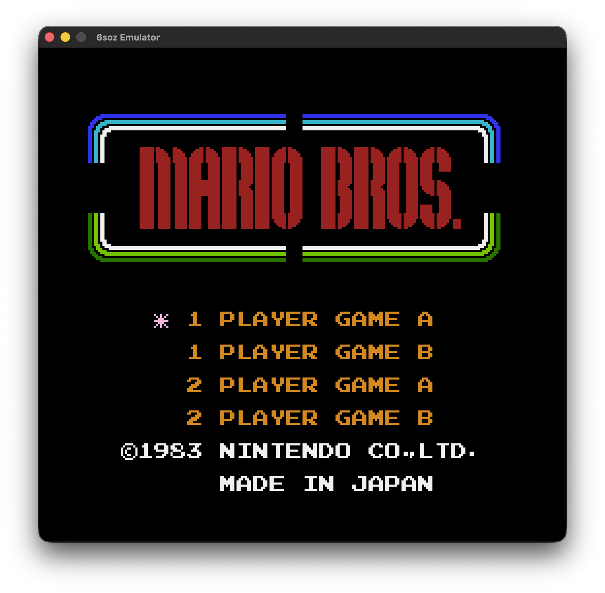

# 6soz

6soz is a multi-system emulator host written in Zig. It currently provides frontends for the NES, Game Boy, and Game Boy Color. The host application uses [raylib](https://github.com/raysan5/raylib) for cross-platform video, audio, and input.

## Architecture

The project is split into decoupled packages and host layers so frontend code,
emulator orchestration, and core emulation can evolve independently:

- **`6soz`**: Host application, CLI tools, web entrypoint, and raylib frontend.
- **`src/common`**: Shared host contracts and state codec helpers.
- **`src/host`**: System facade and emulator-facing host logic.
- **`src/frontend/raylib`**: Window, rendering, audio, and input adapters.
- **`src/cli`**: Native run, benchmark, and smoke-check entrypoints.
- **`src/web`**: Browser entrypoint and custom Emscripten shell.
- **`6soz-nes`**: NES emulator core backend.
- **`6soz-gameboy`**: Game Boy (DMG) and Game Boy Color (CGB) emulator core backend.
- **`6soz-mos6502`**: Standalone MOS 6502 / Ricoh 2A03 CPU module used by the NES core.
- **`6soz-lr35902`**: Standalone Sharp LR35902 CPU module used by the Game Boy core.

## Images

|                                      |                                      |
| ------------------------------------ | ------------------------------------ |
|            |  |
|  |    |

## Requirements

* Zig 0.16.0

## Build

```sh
zig build
```

## Web Build

Build the browser version with:

```sh
zig build web -Doptimize=ReleaseFast
```

The web build writes `zig-out/web/index.html` plus the generated JavaScript,
WebAssembly, and data files. Serve `zig-out/web` over HTTP and open
`index.html`; the browser build starts in the system/ROM menu. It preloads
playable ROMs from `roms/nes` and `roms/gb` plus the Game Boy boot ROM, while
excluding `.sav` and `.state` files. Press `Escape` during gameplay to return
to the ROM menu.

**Sample ROM Credits:**
- `ravens_gate_mmc1.nes` - Ravens Gate (NES) by MercuryBD: https://mercurybd.itch.io/ravens-gate-nes
- `porklike.gb` - Porklike GB by Binji: https://binji.itch.io/porklikegb

## Run

```sh
Usage: 6soz [<system> <rom_path>] [--boot-rom <path>] [--model auto|dmg|cgb] [--config <path>]
```

*Note: `gameboy` can be shortened to `gb`.*

Running without a system and ROM opens the native welcome menu:

```sh
zig build run
```

The menu lets you choose an implemented system, then scans the configured ROM
directory for compatible ROMs. By default it checks `roms/nes` for `.nes` files
and `roms/gb` for `.gb`/`.gbc` files.

**NES Examples:**
```sh
zig build run -Doptimize=ReleaseFast -- nes roms/mario.nes
```

**Game Boy Examples:**
```sh
zig build run -Doptimize=ReleaseFast -- gb roms/game.gb --boot-rom boot/dmg.bin
zig build run -Doptimize=ReleaseFast -- gb roms/game.gbc --boot-rom boot/cgb.bin --model cgb
```

## Config

Native runs load `config.zon` from the project directory by default. If it is
missing, 6soz writes a default copy. Use `--config <path>` to load a different
config file.

The config controls the ROM root, default system, Game Boy boot ROM paths,
Game Boy model, video scale, audio on/off, save/state directories, controls,
and the last ROM selected in the menu. Game Boy menu launches use the configured
boot ROM path automatically.

The host stores battery-backed save data next to the ROM as `<rom_path>.sav`
unless `saves.save_dir` is configured. Save states are stored next to the ROM as
`<rom_path>.state` unless `saves.state_dir` is configured; press `F5` to write a
state and `F8` to load it. Game Boy and Game Boy Color games require a matching
legally obtained boot ROM before they can start or load states.

## Benchmark

Run the headless benchmark executable with:

```sh
zig build bench -Doptimize=ReleaseFast -- <system> <rom_path> [frames_count] [--boot-rom <path>]
```

For example:

```sh
zig build bench -Doptimize=ReleaseFast -- nes roms/mario.nes 1000
zig build bench -Doptimize=ReleaseFast -- gb roms/game.gb 1000 --boot-rom boot/dmg.bin
```

## Compatibility Smoke Checks

Run headless load/step/save-state checks over one ROM or a directory of ROMs.
Unsupported mappers, unsupported timing modes, and unsupported cartridges are
reported as skips; read, reset, frame-step, save-state, and load-state errors
fail the run.

```sh
zig build smoke -- nes roms/nes --frames 2
zig build smoke -- gb roms/gb --frames 2 --boot-rom roms/gb/boot.rom.gb --model dmg
```

For release validation from a clean checkout, run:

```sh
zig build test
zig build
zig build -Dtarget=wasm32-emscripten -Doptimize=ReleaseSmall
zig build smoke -- nes roms/nes/ravens_gate_mmc1.nes --frames 2
zig build smoke -- gb roms/gb/porklike.gb --frames 2 --boot-rom roms/gb/boot.rom.gb --model dmg
```

## License

This project is licensed under the [MIT Licence](LICENCE).
